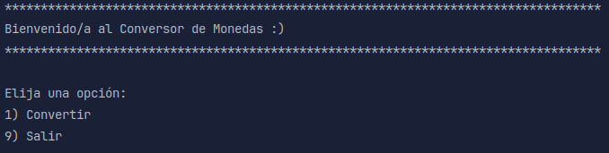
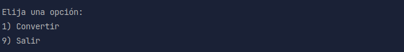
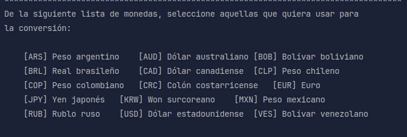
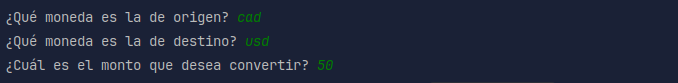

# Conversor de monedas

Este proyecto consiste en un aplicativo que funciona por consola y permite digitar el monto a convertir y seleccionar la moneda de origen y la de destino.

## Características

- Menú en el que hay dos opciones:

  
- Al seleccionar la opción convertir, se muestran los códigos de las monedas que se aceptan y sus nombres.

  
- Se solicita el código de la moneda de origen, de destino y el monto a convertir, si alguno de dichos valores es erróneo se arroja un mensaje en el que se solicita que intente de nuevo.

  
- Resultado

  

## Uso

1. **Seleccionar la opción Convertir:**
   - Se debe digitar en la consola el número 1.
2. **Digitar información para conversión:**
   - Se solicita el código de la moneda de origen.
   - Se solicita el código de la moneda de destino.
   - Se solicita el monto que se desea convertir.
3. **Repetir el paso 1 y 2 las veces que se requiera**
4. **Finalizar el programa:**
   - Se debe digitar en la consola el número 9.

## Notas adicionales
- Para indicar la moneda de origen y de destino se debe cumplir lo siguiente:
  - La moneda debe se alguna que esté en la lista.
  - Debe ser el código, **NO** el nombre de la moneda.
  - Es indiferente si el texto está en minúscula o mayúscula.
- El monto debe ser un **número entero**.

## Tecnologías utilizadas
- `Java 💻`
- `Maven 🚛`
- `Gson 🔄 `
- `API ⚙️`

## Autor
`Brian`

## Recursos usados y/consultados
- [Librería Gson](https://mvnrepository.com/artifact/com.google.code.gson/gson)
- [Class HttpClient](https://docs.oracle.com/en/java/javase/11/docs/api/java.net.http/java/net/http/HttpClient.html)
- [Class HttpRequest](https://docs.oracle.com/en/java/javase/11/docs/api/java.net.http/java/net/http/HttpRequest.html)
- [Interfaz HttpResponse](https://docs.oracle.com/en/java/javase/11/docs/api/java.net.http/java/net/http/HttpResponse.html)
- [Simplificando tu código en Java: Conoce los enum](https://www.youtube.com/watch?v=EoPvlE85XAQ)
